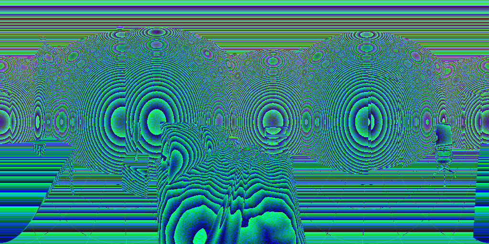

# Non-Central Indoor Dataset

## Introduction

We present the first dataset of non-central panoramas for scene understanding. Our dataset is composed by 2574 images of different Atlanta and Manhattan virtual environments.
We also provide Depth maps for each image as well as the labelling of the structural lines to obtain the layout of the environments. Additionally, we provide different tools to encode and decode the depth maps, different annotations of the dataset in raw MatLab files and Python-friendly files (as well as little programs to transform from the MatLab files to Python files and vice versa), all included in **tools/**

## Download
The next link will take you to the full dataset. It weights around 2.7GB, including images, depth maps and Python-friendly layout annotations.

### Download [here](https://drive.google.com/drive/folders/18OQXpbZsr3RBphU0kJC0OS2OXr-3BrkV?usp=sharing) the full dataset from google Drive or [here](https://data.mendeley.com/datasets/jsxkzsknv3/draft?a=8a75efd8-c004-4cb8-8f24-c0078b844b7f) from Mendeley Datasets.

In the dictionary **ScaledLayoutsSplit.pkl**, we provide the splits used in the works [Scaled 360 layouts: revisiting non-central panoramas](https://openaccess.thecvf.com/content/CVPR2021W/OmniCV/papers/Berenguel-Baeta_Scaled_360_Layouts_Revisiting_Non-Central_Panoramas_CVPRW_2021_paper.pdf) and [Atlanta Scaled layouts from Non-central Panoramas](https://www.sciencedirect.com/science/article/pii/S0031320322002217)

## Citing
For further detail on our dataset, please check [Non-Central Indoor Dataset](https://www.sciencedirect.com/journal/data-in-brief)

## License 

This software is under GNU General Public License Version 3 (GPLv3), please see [GNU License](http://www.gnu.org/licenses/gpl.html)

For commercial purposes, please contact the authors: Jesús Bermudez-Cameo (bermudez@unizar.es), Bruno Berenguel-Baeta (berenguel@unizar.es) and Josechu Guerrero (josechu.guerrero@unizar.es)

## Disclaimer

This site and the code provided here are under active development. Even though we try to only release working high quality code, this version might still contain some issues. Please use it with caution.
